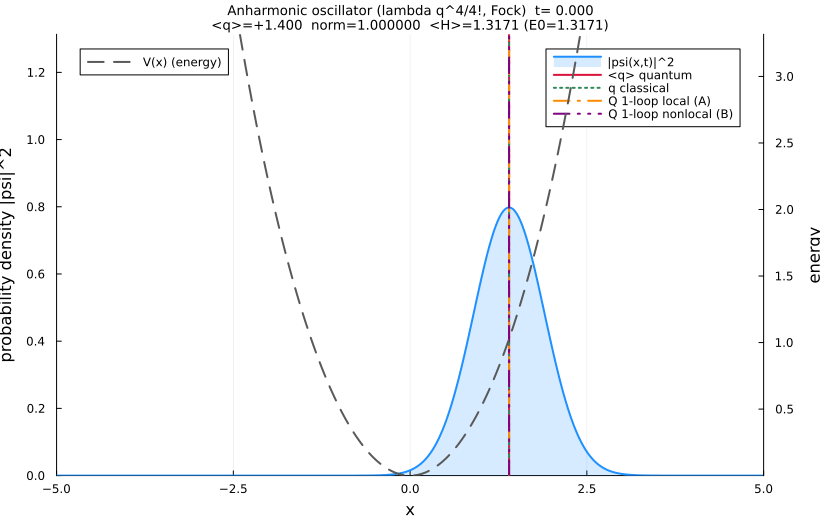
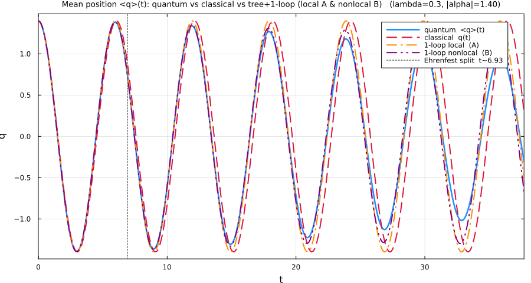

# Anharmonic Quantum Oscillator (Julia)

Numerically evolves a 1D **anharmonic quantum oscillator** starting from a
**coherent state** and animates the time-evolving probability density
`|ψ(x,t)|²` with the potential, the `⟨q⟩(t)` marker, and a live norm/energy
readout.

It also produces a **comparison plot** of the mean position `⟨q⟩(t)` with **four**
curves: the **full quantum** result (numerically exact in an `Ncut`-state Fock basis), the **classical**
solution `q(t)` (tree level), and the two **real-time tree + one-loop** solutions
from [`theory/q4_1_loop.tex`](theory/q4_1_loop.tex) — the **local adiabatic (A)**
and the **causal nonlocal (B)** equations (the leading ħ correction, local vs with
memory). All four start from the same coherent state. The **default parameters
(ħ=0.5, λ=0.3, α=1.4)** are tuned to a weak-anharmonicity, semiclassical regime in
which the **causal nonlocal one-loop (B) tracks the full quantum mean most closely**:
the classical clearly dephases, the local one-loop (A) follows the quantum, and the
nonlocal (B) — whose memory term refines the frequency — is the closest of all
(RMS distance to `⟨q⟩(t)`: classical ≈ 0.34, A ≈ 0.16, **B ≈ 0.13**; the web app
prints the same three numbers in its report).





## Interactive web interface (no install)

**Just double-click [`oscillator.html`](oscillator.html)** — it opens in any
browser with no Julia, no server, and no internet. Edit the parameters, click
**Run**, and immediately see:

- the live **|ψ(x,t)|² animation** (with `V(x)` and the quantum/classical/one-loop
  position markers),
- the **⟨q⟩(t) comparison plot** (full quantum vs classical vs tree+one-loop),
- a physics report (norm/energy conservation, coherent-state checks), and
- a one-click **animated GIF export** (encoded in the browser).

It re-implements the *same* physics as the Julia code (Fock-basis diagonalization
— via an in-browser Jacobi eigensolver — exact-within-`Ncut` evolution, Hermite
reconstruction, RK4 classical + tree+one-loop) and
reproduces the Julia results to ~10 significant figures (e.g. for the defaults
`⟨H⟩(0)=1.317`, and every `⟨q⟩(t)`/classical/one-loop value agrees to ~1e-13; the
tiny difference is the in-browser Jacobi eigensolver vs Julia's LAPACK `eigen`).

The Julia version below remains the reference implementation and test bed.

## Repository layout

```
oscillator.html                interactive browser UI (no install — just open it)
src/anharmonic_oscillator.jl   the Julia simulator (single method, one file)
src/audit_checks.jl            regression / verification suite (39 checks)
fig/                           generated figures (GIF + comparison PNG)
theory/q4_1_loop.{tex,pdf}     tree + one-loop effective-action derivation
README.md
```

## Method

Single method — **Fock (number) basis, numerically exact within an `Ncut`
truncation**:

1. Build `a`, `a†`, `x` as `Ncut × Ncut` matrices.
2. `H = ħω(a†a + ½) + (λ/4!)·x⁴`, the quartic (Duffing) anharmonic oscillator
   with `x = √(ħ/2mω)(a+a†)`. The quartic uses the `λq⁴/4! = (λ/24)q⁴`
   normalization (same as the theory note). The `x⁴` term is the **Galerkin
   projection** `P_N x⁴ P_N` (built in an `N+4` workspace and cropped), *not* the
   naive `(P_N x P_N)⁴` — truncating `x` before raising it to the 4th power would
   delete the virtual paths through Fock levels ≥ N and corrupt the matrix near the
   cutoff (the audit checks this matches the analytic three-band `x⁴`).
3. Diagonalize `H` **once** with `eigen`, then evolve the coherent state in the
   energy eigenbasis: `|ψ(t)⟩ = V·exp(−iEt/ħ)·Vᵀ|ψ(0)⟩`. No time-stepping error
   — norm and energy are conserved to machine precision and **hard-asserted**.
4. Reconstruct `ψ(x,t)` on a grid using harmonic-oscillator eigenfunctions built
   from a numerically stable Hermite recurrence (no factorial/overflow).

**What "exact" / "full quantum" means here:** the evolution is *unitary with no
time-stepping error within the kept `Ncut`-dimensional Fock space* — not the exact
infinite-dimensional answer. The Fock truncation is a separate, controlled
approximation. Crucially, **norm/energy conservation do not detect truncation
error** (both hold inside the kept subspace by unitarity); that is caught by the
`convergence_check` (re-runs at higher `Ncut` and compares the density) and by the
top-5% Fock-population gauges (reported at `t=0` *and* as the max over the whole
evolution, since `x⁴` couples population upward into the cutoff during the run).

This basis needs **zero installs** (stdlib + `Plots` only), and within the
truncation the propagation is unitary to machine precision, so norm/energy
conservation can be hard-asserted rather than just monitored.

## Requirements

- Julia ≥ 1.9 (tested on 1.12). Only `Plots` is needed beyond the standard
  library, and only for the figures; the physics runs without it.

## Run

```bash
julia src/anharmonic_oscillator.jl     # runs defaults, writes figures to fig/
```

Or from the REPL, to change parameters:

```julia
include("src/anharmonic_oscillator.jl")
run_simulation()                                      # defaults
run_simulation(lambda=4.8, alpha=2.5+0.0im, Ncut=200) # stronger anharmonicity
run_simulation(x0=3.0, p0=0.0, lambda=2.4)            # specify x0,p0 instead of alpha
run_simulation(make_gif=false)                        # physics + checks only, no figures
```

## Parameters

All live in the `Params` block near the top of the script (or pass as kwargs to
`run_simulation`):

| Parameter | Meaning | Default |
|---|---|---|
| `hbar` | reduced Planck constant (smaller → more classical) | `0.5` |
| `m`, `omega` | mass, harmonic frequency | `1.0`, `1.0` |
| `lambda` | anharmonicity strength (quartic coeff = `λ/24`) | `0.3` |
| `alpha` | complex coherent amplitude | `1.4 + 0im` |
| `x0`, `p0` | initial ⟨x⟩,⟨p⟩ (override `alpha` if finite) | `NaN` |
| `Ncut` | Fock-space truncation | `140` |
| `xmin`,`xmax`,`Nx` | reconstruction grid | `-5, 5, 600` |
| `autogrid` | grow the grid to contain the wavepacket for large `\|α\|` (never shrinks below `xmin/xmax`) | `false` |
| `tmax`, `Nt` | total time, number of frames | `12π`, `360` |
| `fps`, `giffile` | animation output | `24`, `fig/anharmonic_oscillator.gif` |
| `make_comparison`, `qcompfile` | quantum-vs-classical `q(t)` plot | `true`, `fig/q_comparison.png` |
| `convergence_check` | re-run at higher `Ncut` to gauge truncation error | `true` |

For larger amplitudes raise `Ncut` (guide: `|α|≈3 → Ncut≈250`, `|α|≈3.5 → Ncut≈400`,
`|α|≈4 → Ncut≈600`); the built-in `convergence_check` warns when it is too small.
A typo'd keyword raises an error (it's a `@kwdef struct`).

## Classical equations of motion

The classical reference `q(t)` is the classical limit of the *same* Hamiltonian,
with the same initial condition as the coherent state
(`q(0)=√(2ħ/mω)·Re(α)`, `p(0)=√(2ħmω)·Im(α)`): Newton's law
`q̈ = −ω²q − (λ/6m)q³` (from `V=(λ/24)q⁴`), integrated with a stdlib RK4.

In the animation, the quantum mean `⟨q⟩(t)` (red), classical `q(t)` (green),
tree+1-loop local-A `Q(t)` (orange) and nonlocal-B (purple) markers are shown together.

### Tree + one-loop equations (local & nonlocal)

Two one-loop curves solve the real-time tree-plus-one-loop equations derived in
[`theory/q4_1_loop.tex`](theory/q4_1_loop.tex) for the mean `Q(t) = ⟨q⟩(t)`, both
starting from the same coherent state.

**(A) Local adiabatic** (eq. `final-adiabatic`, `oneloop_trajectory`) — the
Wick-rotated derivative-expansion form, conservative:

```
Z(Q) Q̈ + ½ Z′(Q) Q̇² + V′_eff(Q) = 0,        Ω(Q) = √(ω² + (λ/2m) Q²)
  Z(Q)      = m + ħ λ² Q² / (32 m² Ω⁵)
  ½ Z′(Q)   = ħ λ²/(64 m²) [ 2Q/Ω⁵ − 5 λ Q³/(2m Ω⁷) ]
  V′_eff(Q) = m ω² Q + (λ/6) Q³ + ħ λ Q/(4m Ω)
```

**(B) Causal nonlocal** (eq. `final-nonlocal`, `nonlocal_trajectory`) — the
fluctuation correlator built from free modes gives a **memory** term: the force
at time `t` depends on the past history of `Q`:

```
m Q̈ + m ω² Q + (λ/6) Q³ + ħλ/(4mω) Q
   − ħλ²/(8m²ω²) Q(t) ∫₀ᵗ sin[2ω(t−t′)] Q²(t′) dt′ = 0
```

The trig kernel is separable, so the memory integral becomes two extra
accumulators (`Ċ=cos2ωt·Q²`, `Ṡ=sin2ωt·Q²`, `I = sin2ωt·C − cos2ωt·S`) and the
whole thing is an **exact augmented `(Q,V,C,S)` ODE**, integrated with the same
stdlib RK4 — no history storage. Unlike the conservative (A), (B)'s memory term is
non-conservative, so it can follow the quantum amplitude decay; the suite checks
(B)'s RK4 solution against its integro-differential equation to a <5e-3 residual.

Both share the theory's `V = (λ/4!) q⁴` normalization (no rescaling) and reduce
exactly to the classical EOM as `ħ → 0`; (A) is the local derivative expansion of
the nonlocal (B).

## Verification / audit

A standalone regression suite ([src/audit_checks.jl](src/audit_checks.jl))
independently verifies the physics, numerics, classical EOM, and robustness:

```bash
julia src/audit_checks.jl     # 39 checks; nonzero exit on any failure
```

Highlights of what it proves:

- **Harmonic limit (λ=0)** — quantum `⟨q⟩(t)`, the classical RK4 trajectory, and
  the exact analytic `x₀cos(ωt)+(p₀/mω)sin(ωt)` all coincide to ~1e-12, and the
  density stays a rigid Gaussian. This single test cross-validates *all three*
  computational paths in the one exactly-solvable case.
- Ehrenfest `d⟨x⟩/dt=⟨p⟩/m`, classical energy conserved to 1e-13, RK4 4th-order,
  HO reconstruction basis orthonormal to 1e-14, tree+one-loop EOM residual <1e-3.
- Robustness: graceful Fock-truncation (warns + renormalizes instead of crashing),
  `autogrid` containment, negative-λ classical-divergence warning, friendly errors.

The main script also prints a physics report on every run and **hard-asserts**
norm + energy conservation.
